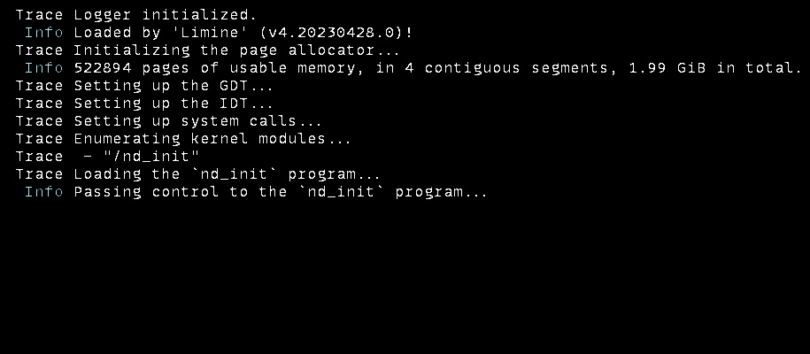

# The Neodym Operating System

This repository is home of the Neodym Operating System. Neodym is an experimental
[exokernel](https://en.wikipedia.org/wiki/Exokernel) and learning project.

## State Of The Project

Nothing to see yet! The project is still in its early stages of development.

We're starting userspace programs, though.

## Installation Guide

At the moment, no pre-compiled binaries for the Neodym operating system are available. The project
is modified basically every day and keeping those up to date would be impossible.

If you want to try out Neodym, you can follow the [installation guid](INSTALLATION.md)!

## Hardware Support

The kernel aims to support multiple CPU architecture (though it is currently mainly focused on
`x86_64`).

Similarly, support for multiple bootloading protocol is planned, though currently, only
[Limine](https://github.com/limine-bootloader/limine/blob/v4.x-branch/PROTOCOL.md) is supported.

Currently, the kernel has only been tested inside of the [QEMU](https://www.qemu.org/) emulator.

## Documentation

The in-code documentation of the project can be generated using `cargo doc --open`.

Some additional documentation (such as design documents and overviews) can be found in the
[docs](docs) directory.

## Acknowledgements

Neodym uses way to many open-source projects, papers, blog posts and other resources to list them
all in this README. A complete list is available [here](ACKNOWLEDGEMENTS.md).
